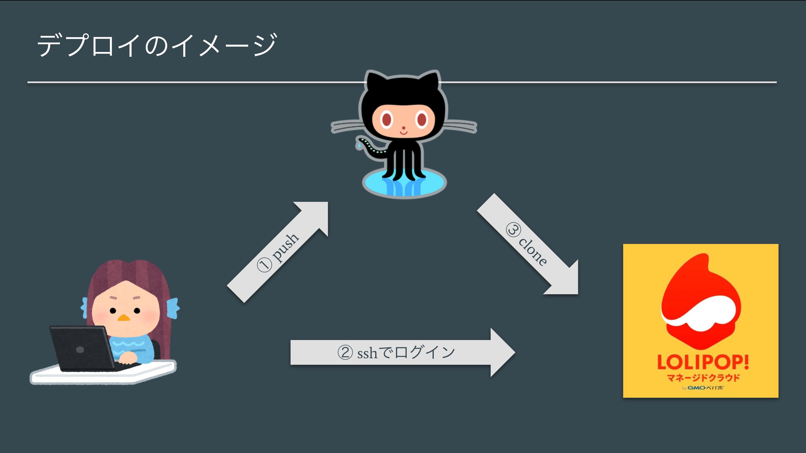

# **aws cloud9 で作成したプロジェクトを lolipop マネージドクラウドにデプロイするまでの手順**

作成日：2019/06/20

更新日：2020/07/01

## **0.目次**

- 1. マネクラでプロジェクトを作成する．
- 2. aws cloud9 で ssh-key を作成する．
- 3. 作成した ssh-key を github に登録する．
- 4. aws cloud9 で作成したプロダクトを github に puah する．
- 5. PC のターミナルで lilopop のサーバにログインする．
- 6. lolipop で ssh-key を発行し，github に登録する．
- 7. lolipop へデプロイする．

実装したプロジェクトを Github に push し，デプロイ先のサーバ（マネージドクラウド）にログインして Github 上のプロジェクトを clone(or pull)することでデプロイを実現する．



## **1. マネクラでプロジェクトを作成する．**

**※ブラウザでの操作**
マネクラに登録してプロジェクトを作成しておく．PHP を選択し，プロジェクト名は任意に設定．

登録したらプロジェクトページを開いておくと良い．

## **2. aws cloud9 で ssh-key を作成する．**

**※aws cloud9 での操作**

プロジェクトの environment を立ち上げておく．

以下のコマンドを順番に実行する．

```bash
$ cd ~/.ssh
```

```bash
$ ssh-keygen
```

実行結果

```bash
Generating public/private rsa key pair.
Enter file in which to save the key (/home/ubuntu/.ssh/id_rsa):
Enter passphrase (empty for no passphrase):
Enter same passphrase again:
Your identification has been saved in /home/ubuntu/.ssh/id_rsa.
Your public key has been saved in /home/ubuntu/.ssh/id_rsa.pub.
The key fingerprint is:
SHA256:n7fnnBQCsfgRW+skKRqTGscuroFrnZvo2t3zh4uaQEQ ubuntu@ip-172-31-35-172
The key's randomart image is:
+---[RSA 2048]----+
|  w       w .    |
| .   . . . w .   |
|  . . * w w w    |
| .   = + w *     |
|  . w w w . w .  |
| w . .   . . . . |
|. + w    .w . .  |
| +.B.w... .. +.. |
|*www=.wwww  .w+  |
+----[SHA256]-----+
```

引き続き以下を実行し，ssh-key を表示する．

```bash
$ cat ~/.ssh/id_rsa.pub
```

実行結果

```bash
ssh-rsa AAAAB3NzaC1yc2EAAAADAQABAAABAQCu8btWWrpYcfx3Wn02FMs1v0DnZw+vNJi4U9Jq4Jq/K1f2uv40fOrfQ26asux9ME6ai+aCyNnmz7oQnWv9gcqMEHtVLzi4x0CJ11oskIqNoAJe0do2wwwwwwwwwwwwwwwwg9WnbB0aqaJtntZOs4I8RM3SD5LPvGtktPhpjBWLK4lt6bV+KDxYuWPN5ciVX7fp7H9MI7jJu/ksvDXsU4OStutPyAucPHt6iBVC3c3IlL124yoevkZGOYZyXHX+jlRcRO8oyCa0L6cRHUzi8djBcuBAX7Uwpk1aS5kplzCsLLifALwePiiy+I8Calsq9ThX+uqo16VXiZkY/+JKJDH/ ubuntu@ip-172-31-35-172
```

## **3. 作成した ssh-key を github に登録する．**

**※ブラウザでの操作**

github のサイトに aws cloud9 で作成した ssh-key を登録する．

プロジェクト用のリポジトリを新しく作成し，url をコピーしておく．

## **4. aws cloud9 で作成したプロダクトを github に puah する．**

**※aws cloud9 での操作**

【重要】まずプロジェクトのディレクトリに移動する，

以下のコマンドを実行する．

```bash
$ cd ~/environment/プロジェクト名
```

```bash
$ git init
```

```bash
$ git remote add origin YOUR_REPOSITORY_URL
```

```bash
$ git add .
```

```bash
$ git commit -m"first commit"
```

```bash
$ git push origin master
```

## **5. PC のターミナルで lilopop のサーバにログインする．**

**※ブラウザでの操作**
lolipop のページの右上から「SSH 公開鍵の追加」をクリック．

自分の PC に保存されている ssh-key を適当に登録する．

**ない場合は，PC のターミナルで**以下の流れで作成&表示し，マネクラに登録する．

```bash
$ cd ~/.ssh
```

```bash
$ ssh-keygen
```

```bash
$ cat ~/.ssh/id_rsa.pub
```

ブラウザでプロジェクトのページを開いていない場合は再度開いておく．

**※PC のターミナルでの操作**

マネクラのプロジェクトページに表示されている「SSH コマンド」を入力してサーバにアクセスする．

**下記は一例なので必ず「自分のプロジェクト管理画面に表示されている SSH コマンド」を実行すること．**

```bash
$ ssh -p 38216 reliable-amami-8204@ssh-1.mc.lolipop.jp
```

実行結果．（何か訊かれたら yes で進む）

```bash
The authenticity of host '[ssh-1.mc.lolipop.jp]:38216 ([157.7.190.236]:38216)' can't be established.
ECDSA key fingerprint is SHA256:fqQ1YxW9OFrAwKVtnt92YIB2Bv6MQfJVGRo73gktLmk.
Are you sure you want to continue connecting (yes/no)? yes
Warning: Permanently added '[ssh-1.mc.lolipop.jp]:38216,[157.7.190.236]:38216' (ECDSA) to the list of known hosts.
Last login: Thu Jun 20 02:06:09 2019 from 10.1.36.1
  __  __  ____   _          _ _
 |  \/  |/ ___| | |    ___ | (_)_ __   ___  _ __
 | |\/| | |     | |   / _ \| | | '_ \ / _ \| '_ \
 | |  | | |___ _| |__| (_) | | | |_) | (_) | |_) |
 |_|  |_|\____(_)_____\___/|_|_| .__/ \___/| .__/
export PATH=$PATH:/var/www/bin
                               |_|         |_|

******* Welcome to Lolipop! Managed Cloud *******

reliable-amami-8204@ssh-aws-laravel01:~$
```

この状態で`reliable-hoge-6666@ssh-aws-laravel01:~$ `（← 状況によって文字列は異なる）となっていればうまくログインできている状態．

ある程度時間が経過すると自動的にログアウトされるので，その場合は再度 SSH コマンドを実行するとログインできる．

**※以下の「lolipop での操作」は上記の状態になっていることを確認すること．**

## **6. lolipop で ssh-key を発行し，github に登録する．**

**※lolipop での操作**

ssh キーを作成し，マネクラと Github の間で通信できるようにする．

```bash
$ cd .ssh
```

```bash
$ ssh-keygen
```

実行結果

```bash
Generating public/private rsa key pair.
Enter file in which to save the key (/var/www//.ssh/id_rsa):
Enter passphrase (empty for no passphrase):
Enter same passphrase again:
Your identification has been saved in /var/www//.ssh/id_rsa.
Your public key has been saved in /var/www//.ssh/id_rsa.pub.
The key fingerprint is:
SHA256:NPkD2j3bgqXWJ2G2nO2hMjGh3pZwruePjPnFosuUuPc reliable-amami-8204@ssh-aws-laravel01.lolipop.io-2adc16106d
The key's randomart image is:
+---[RSA 2048]----+
|                 |
|         .       |
|        =        |
|       +.=       |
|      ..w.w      |
|     .w.+w w     |
|    ..w==+@ =    |
|     +w*w+ * .   |
|    ..www+w .    |
+----[SHA256]-----+
```

```bash
$ cat id_rsa.pub
```

実行結果

```bash
ssh-rsa AAAAB3NzaC1yc2EAAAADAQABAAABAQDJPmXzhA733dAupv+pVUG6I04agsUSKI7BeekJgBn//1P7Ca96JJkqd1M8yBHARSJxYdSUC31Dn9UpmO87XVLVlVCjmwwwwwwwwwwwwwwwwzIqvRtJmOfvQEfJ/cvBA/bPkrD3V80epwlWiVfWNPSKIZYKVf3LRJI2RoU8WtNSI/Zc8VOH+NOxRVQRQrYaHUSjKDqwFqKK/ttuG4xoRHXPI4Xj4rNn+zfNcd52z0Njq/TtpOAZ6TH6Xtg366sc60HJpIBcQfiz8Kq1mpmw5aLqTzz2l6V0rbsQB0zZCIaqdpFdRUf47aMRBpqK10LPB9N8jC3Gq5Gb1WuJY5Asbzxp reliable-amami-8204@ssh-aws-laravel01.lolipop.io-2adc16106d
```

**※ブラウザでの操作**

github サイトに ssh-key を登録．流れはこれまでと同様．

## **7. lolipop にデプロイする．**

**※lolipop での作業**

まず，デプロイに関する準備をする．

以下を順に実行する．

```bash
$ cd /var/www
```

```bash
$ mkdir bin
```

```bash
$ cd bin
```

```bash
$ php -r "copy('https://getcomposer.org/installer', 'composer-setup.php');"
```

composer のセットアップ

```bash
$ php composer-setup.php
```

実行結果

```bash
All settings correct for using Composer
Downloading...

Composer (version 1.10.8) successfully installed to: /var/www/bin/composer.phar
Use it: php composer.phar
```

```bash
$ mv composer.phar composer
```

```bash
$ export PATH=$PATH:/var/www/bin
```

.bash_profile を開く．

```bash
$ vi ~/.bash_profile
```

.bash_profile に以下を追記

```bash
export PATH=$PATH:/var/www/bin
```

引き続き，以下のコマンドを順に実行する．

```bash
$ cd /var/www
```

laravel の準備をする．

```bash
$ composer global require 'laravel/installer'
```

実行結果

```bash
...
symfony/console suggests installing psr/log (For using the console logger)
guzzlehttp/guzzle suggests installing psr/log (Required for using the Log middleware)
Writing lock file
Generating autoload files
11 packages you are using are looking for funding.
Use the `composer fund` command to find out more!
```

github から自分が作成したプロジェクトのファイルをダウンロードして`project`ディレクトリにコピーする．

```bash
$ git clone YOUR_REPOSITORY_URL project
```

実行結果

```bash
Cloning into 'project'...
Warning: Permanently added the RSA host key for IP address '11.11.111.11' to the list of known hosts.
remote: Enumerating objects: 140, done.
remote: Counting objects: 100% (140/140), done.
remote: Compressing objects: 100% (104/104), done.
remote: Total 140 (delta 17), reused 140 (delta 17), pack-reused 0
Receiving objects: 100% (140/140), 195.58 KiB | 0 bytes/s, done.
Resolving deltas: 100% (17/17), done.
Checking connectivity... done.
```

```bash
$ cd /var/www/project/
```

必要なライブラリをインストールする．

```bash
$ composer install
```

実行結果（長い）

```bash
...
Discovered Package: beyondcode/laravel-dump-server
Discovered Package: fideloper/proxy
Discovered Package: laravel/tinker
Discovered Package: nesbot/carbon
Discovered Package: nunomaduro/collision
Package manifest generated successfully.
43 packages you are using are looking for funding.
Use the `composer fund` command to find out more!
```

設定ファイルを準備する．

```bash
$ cp .env.example .env
```

設定ファイルを編集する．

```bash
$ vi .env
```

以下のように編集する．

```bash
DB_CONNECTION=mysql
DB_HOST=マネクラ管理画面にあるDBのホスト名
DB_PORT=3306
DB_DATABASE=マネクラ管理画面にあるDB名
DB_USERNAME=マネクラ管理画面にあるユーザー名
DB_PASSWORD=プロジェクト作成時に決めたpwd
```

マイグレーションを実行してテーブルを準備する．

```bash
$ php artisan migrate
```

実行結果

```bash
Migration table created successfully.
Migrating: 2014_10_12_000000_create_users_table
Migrated:  2014_10_12_000000_create_users_table (0.01 seconds)
Migrating: 2014_10_12_100000_create_password_resets_table
Migrated:  2014_10_12_100000_create_password_resets_table (0.01 seconds)
Migrating: 2019_08_19_000000_create_failed_jobs_table
Migrated:  2019_08_19_000000_create_failed_jobs_table (0 seconds)
Migrating: 2020_06_23_024905_create_tasks_table
Migrated:  2020_06_23_024905_create_tasks_table (0 seconds)
```

アプリケーションキーを作成する．

```bash
$ php artisan key:generate
```

実行結果

```bash
Application key set successfully.
```

ルートディレクトリを設定できないので，/var/www/html をシンボリックリンクにして/var/www/project/public/を参照する．

```bash
$ rm -rf /var/www/html/
```

```bash
$ ln -s /var/www/project/public/ /var/www/html
```

ブラウザでプロジェクトの url にアクセスして表示されれば OK！

以上である( `･ω･)b
